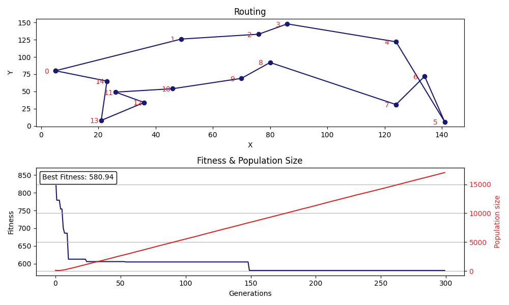

# Solving Travelling Salesman Problem (TSP) Using Genetic Algorithm 

## What is Travelling Salesman Problem (TSP)? 
The travelling salesman problem (TSP) is the challange of finding the shortest route for a person to take given a list of specific destinations. I 

## Result of try to solve TSP using genetic algorithm
I implemented genetic algorithm in Python and the result, as shown in the image below



## Usage

```
pip3 install matplotlib
pip3 install numpy
git clone https://github.com/numancan/solving-TSP-genetic-algorithm.git
python3 ./solving-TSP-genetic-algorithm/tsp.py
```